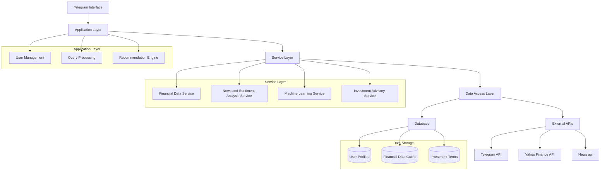

```mermaid
graph TD
    A[Telegram Interface] --> B[Application Layer]
    B --> C[Service Layer]
    C --> D[Data Access Layer]
    D --> E[External APIs]
    D --> F[Database]
    
    B --> G[User Management]
    B --> H[Query Processing] 
    B --> I[Recommendation Engine]
    
    C --> J[Financial Data Service]
    C --> K[News and Sentiment Analysis Service]
    C --> L[Machine Learning Service]
    C --> M[Investment Advisory Service]
    
    E --> N[Telegram API]
    E --> O[Yahoo Finance API]
    E --> P[News api]
    
    F --> Q[(User Profiles)]
    F --> R[(Financial Data Cache)]
    F --> S[(Investment Terms)]
    
    subgraph "Application Layer"
    G
    H
    I
    end
    
    subgraph "Service Layer"
    J
    K
    L
    M
    end
    
    subgraph "Data Storage"
    Q
    R
    S
    end
```